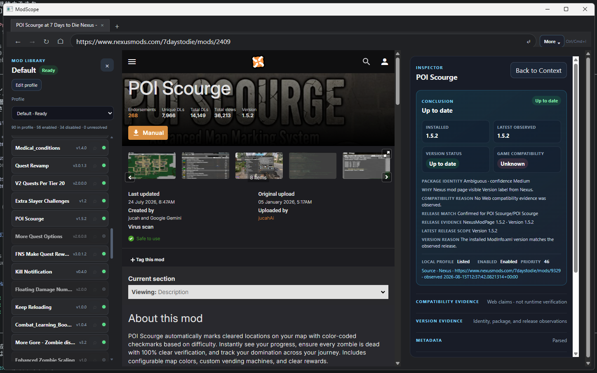
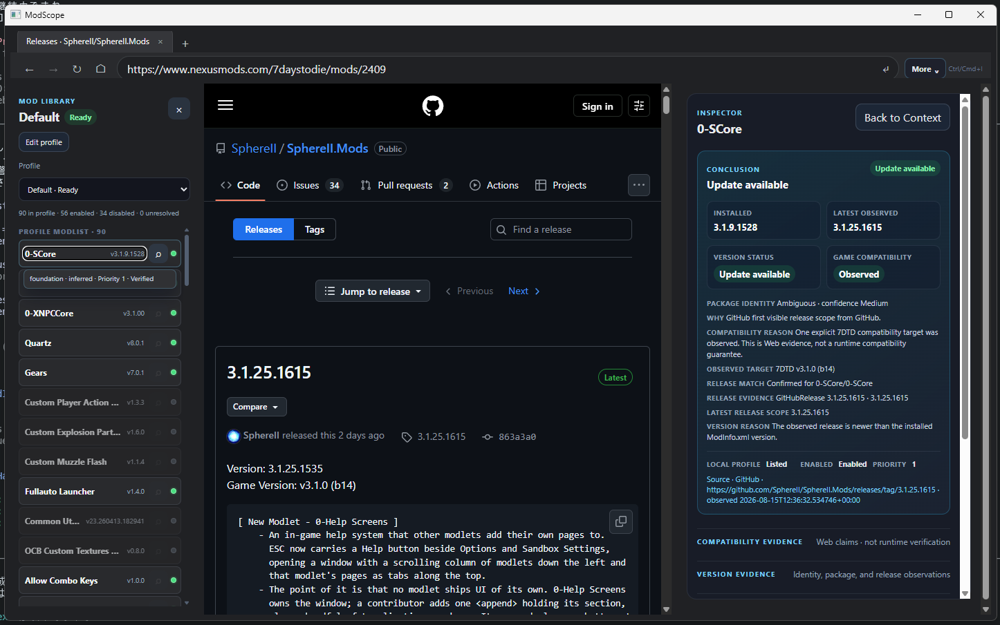
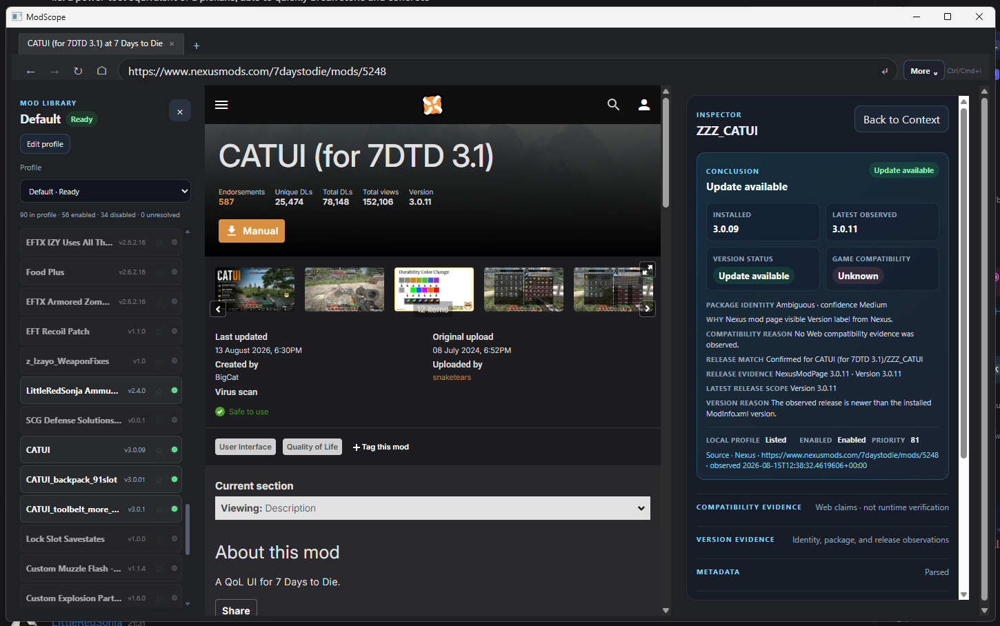
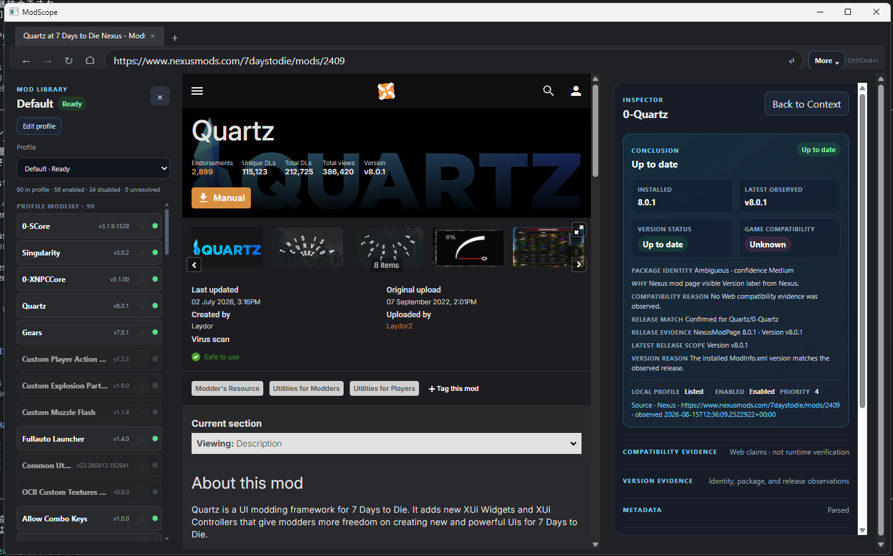

# ModScope

ModScope is a browse-first workspace for discovering, organizing, and understanding 7 Days to Die mods managed by Mod Organizer 2 (MO2).

It connects the web page a user is exploring with structured local Mod Knowledge. The result is an inspectable path from page observation to local context, evidence, and diagnostics.

## Why ModScope

- **Browse and recognize.** Explore mod pages on the web and identify the mod candidate shown by the page.
- **See local context.** Compare the recognized mod with the current MO2 profile, including installed state, enabled state, priority, and known version observations.
- **Inspect the evidence.** Open metadata, files, XML patch observations, requirements observations, compatibility observations, provenance, and diagnostics when more detail is needed.
- **Keep uncertainty visible.** `Unknown`, `Unresolved`, and `Not assessed` are valid results when the available evidence is not sufficient.
- **Stay useful without AI.** Human users can browse, inspect, compare, and understand their local mod environment without an AI dependency.

## Current implementation scope

The current implementation focuses on a 7 Days to Die + MO2 vertical slice:

- Web page, mod recognition, local context, Mod Library, and Inspector surfaces.
- Read-only Local Mod Knowledge generated from an explicitly selected MO2 source.
- Structured observations for profiles, modlists, enabled state, priority, `ModInfo.xml`, files, Config XML, XML patch operations, and diagnostics.
- Query projections for local records, reverse references, version evidence, requirement observations, and compatibility observations.
- Controlled profile edits with preview, explicit approval, timestamped backup, rollback, and re-read verification.
- Junction deployment and fixed Steam launching after a successful apply.

The system preserves raw data, normalized values, static evidence, runtime evidence, inference, uncertainty, and diagnostics as separate concepts. Unknown XML operations, attributes, and elements are retained with diagnostics instead of being silently discarded.

Compatibility observations from web sources are web evidence. They are not runtime verification or a guarantee that a mod works in every environment. Dependency evidence, file overlap, and manifest co-presence are not treated as equivalent to compatibility or runtime evidence.

MO2 remains the source of truth for mods, profiles, downloads, and MO2-managed state. ModScope stores regenerable derived data such as snapshots, indexes, caches, normalized metadata, search results, conflict results, and query read models. ModScope does not replace MO2.

## Screenshots

<table>
  <tr>
    <td></td>
    <td></td>
  </tr>
  <tr>
    <td></td>
    <td></td>
  </tr>
</table>

## Design documents

- [Design](docs/design.md) — product definition, architecture, evidence model, and implementation boundaries.
- [Future vision](docs/future-vision.md) — longer-term direction for the Web page and Local Mod Knowledge surfaces.
